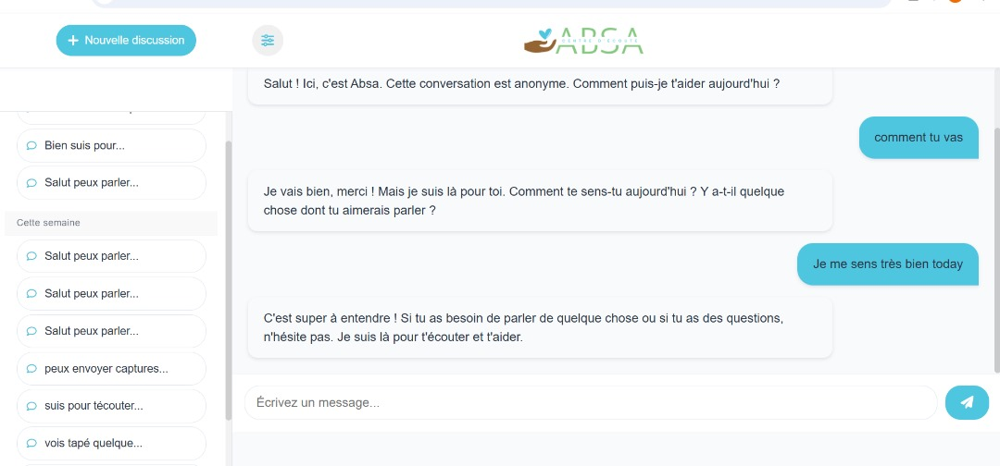

#  
## Absa 
Ton agent conversationnel dédié à l'écoute et au signalement du cyberharcèlement et des violences en ligne.

## 🚀 Fonctionnalités 
-  Interface propre et responsive avec **HTML/CSS**
- Chatbot
- Sauvegarde des conversations 
- Affichage de l'historique
- Possibilité de renouveler le chat avec un bouton

## 🖼️ Aperçu


## 📁 Structure du projet
```
|__admin
|__base
|   |__absa_db
|__conversations
|__css
|__img
|__includes
|   |__request-traitment.php
|   |__reset-conversation.php
|   |__track_links.php
|   |__db-config.php
|   |__get-conversation.php
|   |__get-conversations.php
|   |__save-message.php
|__logs
|__script
|__index.html
|__LICENCE
|__README.md
```

## 💾 Technologies utilisées 

- PHP
- MySQL
- HTML5 / CSS3
- JavaScript
- API

## ✅ Prérequis
- Serveur local (ex : XAMPP)
- PHP 7.4

## 📌 Utilisation
1. Clone le dépôt :
```bash
git clone https://github.com/ton-utilisateur/ton-repo.git  
```
2. Lance ton serveur local (Apache)
3. Accède à http://localhost/ton-projet/index.php
# absa
